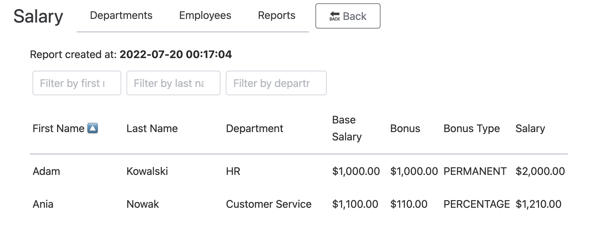

# Payroll 💸

Small application built for manage employments, and generate salary reports.



## 📝 Assumptions

- ☑️ Application is built using as many patterns and good practices as possible in a finite time
- ☑️ Report generating process is ready to run it asynchronously
- ☑️ Framework installation deferred as long as possible, use framework-agnostic approach
- ☑️ App has a basic C4 model and EventStorming session output
- ☑️ Single employee could be attached to only one department 
- ☑️ Domain is open to define new salary calculations types
- ☑️ Report read model must be as simple and fast as possible, like single database table without any relations required
- ☑️ Reports needs to be sortable and filterable
- ☑️ You can generate as many reports as you need, and app should keep all historical reports
- ☑️ App frontend must be simple as possible using basic tools, like CSS and JS framework from cdn

## 🚀 Setup local environment

Just run

```shell
make up
```

this command will build and create entire docker environment, and will load database fixtures

## 🧪 Run tests

To run functional tests, you have to go inside docker shell

```shell
make shell
```

and then

```shell
make test
```

or you can run only specific type tests

```shell
make test-all
make test-unit
make test-integration
make test-functional
```

If you're not using docker environment, you have to load fixtures before running functional tests

```shell
php bin/console doctrine:fixtures:load
```

## 🧑‍🚀 Other usefully commands

All commands prefixed with [docker] are executed using docker-compose command inside container.  
The rest of them are executed locally, so if you want to run them in docker, you have to go into it first, using `make shell` command.

```shell
Usage:
  make TARGET

Targets:
  up          [docker] Up and run docker environment
  down        [docker] Stop environment
  shell       [docker] Go inside docker container
  lint        Execute all available linters
  fix         Fix all code formatting problems
  test        Run tests
  test-%      Run specific tests `test-[all|unit|integration|functional]`
  fixtures    Prune database and load fixtures
```

## 🏗️ Architecture

- [Event Storming](./docs/EventStorming.md)
- [C4 model](./docs/C4-model.md)
