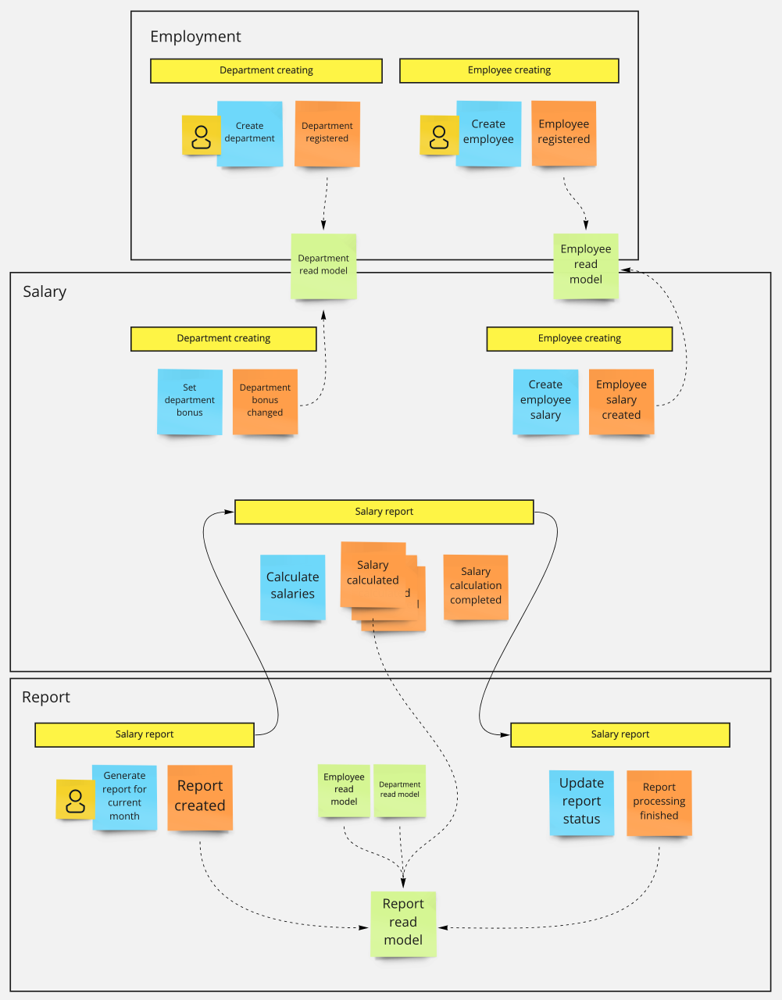

# Event Storming session

I made short event storming session, where I built a big-picture context of an application.
I managed to find three contexts:

- `Employment` - this context is basically a catalog with departments, employees, and relation between them.
- `Salary` - in this context aggregates all data required to properly calculate salaries.
- `Report` - simple context, to keep report information, status and date of generating.

I discovered also two small processes, about creating department and employee, and one bigger, about generating salary report.
This process is going across report and salary contexts, so I need to define a process manager here.

Output of the session:

